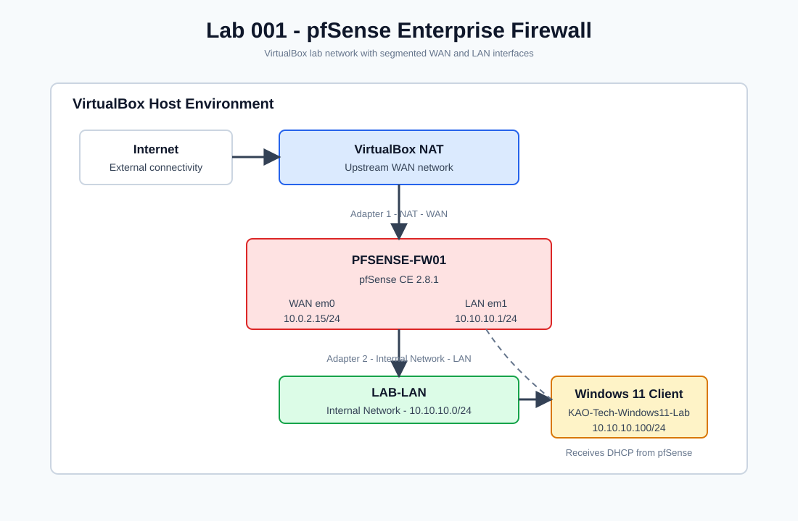

# Enterprise Cybersecurity Home Lab

## Overview

This repository documents the design, deployment, validation, and security hardening of an enterprise-style cybersecurity home lab.

The purpose of this project is to build practical, job-relevant experience across networking, Windows administration, Active Directory, firewall management, endpoint security, logging, SIEM operations, and incident response. Each lab is documented with screenshots, validation results, troubleshooting notes, snapshots, and Git history.

This is not a collection of isolated virtual machines. It is a growing enterprise environment built in phases.

## Career Goal

This lab is designed to demonstrate hands-on skills for roles such as:

- SOC Analyst
- IT Support Technician
- Junior Systems Administrator
- Security Analyst
- Security Engineer
- Cloud Security Engineer
- DFIR Analyst

Each completed phase produces portfolio-ready documentation, resume bullets, interview talking points, and evidence that can be reviewed by employers.

## Current Architecture



```text
                    Internet
                        |
                 Home / Host Network
                        |
                 VirtualBox NAT
                        |
                WAN - 10.0.2.15/24
                +----------------------+
                |     PFSENSE-FW01     |
                | pfSense CE 2.8.1     |
                +----------------------+
                LAN - 10.10.10.1/24
                        |
              VirtualBox Internal Network
                      LAB-LAN
                        |
              +----------------------+
              | Windows 11 Client    |
              | 10.10.10.100/24      |
              +----------------------+
```

## Completed Projects

| Project | Status | Skills Demonstrated |
| --- | --- | --- |
| [Lab 001 - pfSense Enterprise Firewall](01-pfSense-Firewall/README.md) | Complete | Firewall deployment, WAN/LAN segmentation, DHCP, DNS validation, WebGUI setup, credential hardening, evidence collection |

## Project Roadmap

| Phase | Project | Status |
| --- | --- | --- |
| 01 | pfSense Firewall | Complete |
| 02 | Windows Server | Planned |
| 03 | Active Directory Domain Services | Planned |
| 04 | Windows 11 Domain Client | Planned |
| 05 | Group Policy | Planned |
| 06 | Kali Linux Attack VM | Planned |
| 07 | Sysmon Endpoint Logging | Planned |
| 08 | Splunk Enterprise | Planned |
| 09 | Microsoft Sentinel | Planned |
| 10 | Incident Response and Threat Hunting | Planned |

## Evidence Standard

Every lab includes:

- Build log
- Validation notes
- Screenshots
- VirtualBox snapshots
- Troubleshooting notes
- Security considerations
- Git commits
- Resume bullet
- Interview talking points

Evidence is stored inside each lab folder under:

```text
Evidence/Screenshots/
```

## Repository Structure

```text
Enterprise-Cybersecurity-Home-Lab/
|
|-- 00-Documentation/
|-- 01-pfSense-Firewall/
|   |-- README.md
|   |-- Build-Log.md
|   |-- Validation.md
|   |-- Troubleshooting.md
|   |-- Lessons-Learned.md
|   |-- Evidence/
|   |   |-- Screenshots/
|   |   |-- Config-Backups/
|   |   |-- Snapshots/
|   |-- Scripts/
|   |-- Images/
|
|-- diagrams/
|-- scripts/
|-- README.md
```

## Lab 001 Summary

The first completed lab deployed pfSense as the enterprise firewall for the environment.

Key outcomes:

- Created `PFSENSE-FW01` in VirtualBox.
- Configured WAN with VirtualBox NAT.
- Configured LAN with the `LAB-LAN` internal network.
- Set the LAN subnet to `10.10.10.0/24`.
- Installed pfSense CE `2.8.1`.
- Validated WAN Internet connectivity.
- Validated DNS resolution.
- Connected a Windows 11 client to the LAN.
- Verified DHCP assignment from pfSense.
- Verified client Internet and DNS access through pfSense.
- Completed the pfSense WebGUI setup wizard.
- Changed and validated the admin password.
- Created recovery snapshots at stable milestones.

Full documentation:

[Lab 001 - pfSense Enterprise Firewall](01-pfSense-Firewall/README.md)

## Skills Demonstrated

### Networking

- IP addressing
- WAN/LAN segmentation
- DHCP
- DNS validation
- Default gateway validation
- Internal network design

### Firewall Administration

- pfSense installation
- Interface assignment
- WebGUI setup
- WAN/LAN configuration
- Initial firewall hardening

### Systems Administration

- VirtualBox VM provisioning
- Snapshot management
- Windows client validation
- Lab documentation

### Security Operations

- Credential hardening
- Evidence collection
- Troubleshooting documentation
- Change tracking
- Validation methodology

## Business Value

This lab creates the network perimeter and internal routing foundation required for future enterprise services. pfSense provides segmentation, routing, DHCP, DNS forwarding, firewall management, and a controlled environment for future identity, endpoint, monitoring, and detection labs.

## Resume Highlight

Designed and deployed a pfSense-based enterprise firewall lab in VirtualBox, implementing WAN/LAN segmentation, DHCP services, client routing, DNS validation, WebGUI hardening, snapshot recovery points, and GitHub-ready documentation with evidence-based validation.

## Interview Talking Points

- How pfSense separates WAN and LAN traffic.
- Why the lab uses `10.10.10.0/24` for the internal network.
- How DHCP and DNS were validated from a Windows client.
- Why RFC1918 blocking was disabled for the VirtualBox NAT WAN.
- Why default firewall credentials must be changed immediately.
- How snapshots support recovery and change control.
- How this firewall will support future Active Directory and SIEM labs.

## Next Project

The next major build is Windows Server and Active Directory.

Planned work:

- Create `DC01`.
- Install Windows Server.
- Configure static IP addressing.
- Install Active Directory Domain Services.
- Promote the server to a domain controller.
- Create OUs, users, groups, and service accounts.
- Join the Windows 11 client to the domain.
- Document the full identity infrastructure build.
